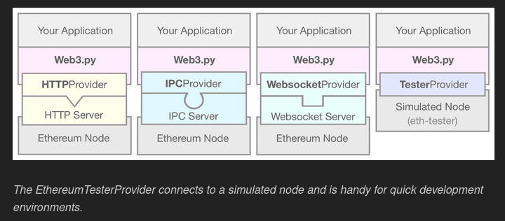

# etherium-practicee

https://ethereum.org/en/developers/tutorials/a-developers-guide-to-ethereum-part-one/


## 01. Installation

```
pip install web3
pip install 'web3[tester]'
```

## 02. Sandbox

The Web3 module is used for convenience functions for ETH.

```ipython
In [1]: from web3 import Web3
```

## 03. Web3 Module

The `fromWei` and `toWei` functions are used to convert between currency denomiations.

1 ether = 1000000000000000000 wei

1 wei = 0.000000000000000001 ether (18 decimal places)

```ipython
In [2]: Web3.toWei(1, 'ether')
Out[2]: 1000000000000000000

In [3]: Web3.fromWei(500000000, 'gwei')
Out[3]: Decimal('0.5')
```

gwei is another denomination which is how fees are represented.

Some functions:
* fromWei
* toWei
* toHex
* isAddress
* keccak (hashing)

## 03. Talk to the chain

We have the option to use IPC, HTTP, or Websocket providers.

> We won't be going down this path, but an example of a complete workflow using the HTTP Provider might look something like this:
> Download an Ethereum node, e.g., Geth.
> * Start Geth in one terminal window and wait for it to sync the network. The default HTTP port is 8545, but is configurable.
> * Tell Web3.py to connect to the node via HTTP, on localhost:8545. w3 = Web3(Web3.HTTPProvider('http://127.0.0.1:8545'))
> * Use the w3 instance to interact with the node.
>
> While this is one “real” way to do it, the syncing process takes hours and is unnecessary if you
> just want a development environment. Web3.py exposes a fourth provider for this purpose, the
> EthereumTesterProvider. This tester provider links to a simulated Ethereum node with relaxed
> permissions and fake currency to play with.



(`eth-tester`/`web3[tester]`)

Instantiate tester provider:

```ipython
In [4]: w3 = Web3(Web3.EthereumTesterProvider())
```

## 04. Quick Tour

We can check the connection.

```ipython
In [5]: w3.isConnected()
Out[5]: True
```

We can view the accounts (fake accounts preloaded with test ether).

```ipython
In [6]: w3.eth.accounts
Out[6]: ['0x7E5F4552091A69125d5DfCb7b8C2659029395Bdf',
 '0x2B5AD5c4795c026514f8317c7a215E218DcCD6cF',
 '0x6813Eb9362372EEF6200f3b1dbC3f819671cBA69', ...]
```

We can view the balance of an account:

```ipython
In [7]: w3.eth.getBalance(w3.eth.accounts[0])
Out[7]: 1000000000000000000000000

In [8]: w3.fromWei(1000000000000000000000000, 'ether')
Out[8]: Decimal('1000000')
```

We can look at the state of our simulated blockchain:

```ipython
In [9]: w3.eth.getBlock('latest')
Out[9]: AttributeDict({
   'number': 0,
   'hash': HexBytes('0x9469878...'),
   'parentHash': HexBytes('0x0000000...'),
   ...
   'transactions': []
})

from pprint import pprint
pprint(dict(w3.eth.getBlock('latest')))

```


> A lot of information gets returned about a block, but just a couple things to point out here:
> * The block number is zero — no matter how long ago you configured the tester provider. Unlike the real Ethereum network, which mines a new block roughly every 15 seconds, this simulation will wait until you give it some work to do.
> * `transactions` is an empty list, for the same reason: we haven’t done anything yet. This first block is an empty block, just to kick off the chain.
> * Notice that the `parentHash` is just a bunch of empty bytes. This signifies that it's the first block in the chain, also known as the `genesis` block.

We will be stuck at block 0 until there is a transaction to mine.

We can send a transactions:

```ipython
In [10]: tx_hash = w3.eth.sendTransaction({
   'from': w3.eth.accounts[0],
   'to': w3.eth.accounts[1],
   'value': w3.toWei(3, 'ether')
})
```

> This is typically the point where you’d wait for several seconds for your transaction to get mined into a new block. The full process goes something like this:
> * Submit a transaction and hold on to the transaction hash. Until it gets mined, the transaction is “pending.” tx_hash = w3.eth.sendTransaction({ … })
> * Wait for the transaction to be mined: w3.eth.waitForTransactionReceipt(tx_hash)
> * Continue application logic. To view the successful transaction: w3.eth.getTransaction(tx_hash)

We can view the transaction we sent after it has been mined into a block:

```ipython
In [11]: w3.eth.getTransaction(tx_hash)
Out[11]: AttributeDict({
   'hash': HexBytes('0x15e9fb95dc39...'),
   'blockNumber': 1,
   'transactionIndex': 0,
   'from': '0x7E5F4552091A69125d5DfCb7b8C2659029395Bdf',
   'to': '0x2B5AD5c4795c026514f8317c7a215E218DcCD6cF',
   'value': 3000000000000000000,
   ...
})

pprint(dict(w3.eth.getTransaction(tx_hash)))
```

We can now see that the balances have changed:

```ipython
In [12]: w3.eth.getBalance(w3.eth.accounts[0])
Out[12]: 999996999999999999979000

In [13]: w3.eth.getBalance(w3.eth.accounts[1])
Out[13]: 1000003000000000000000000
```

Account (2) has gained 3 ether, while account (1) has lost 3 ether plus 21000 wei in fees.


### Cool :)