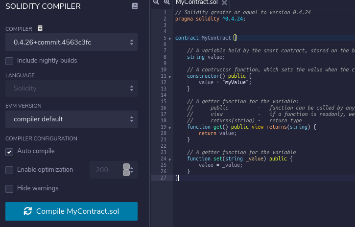
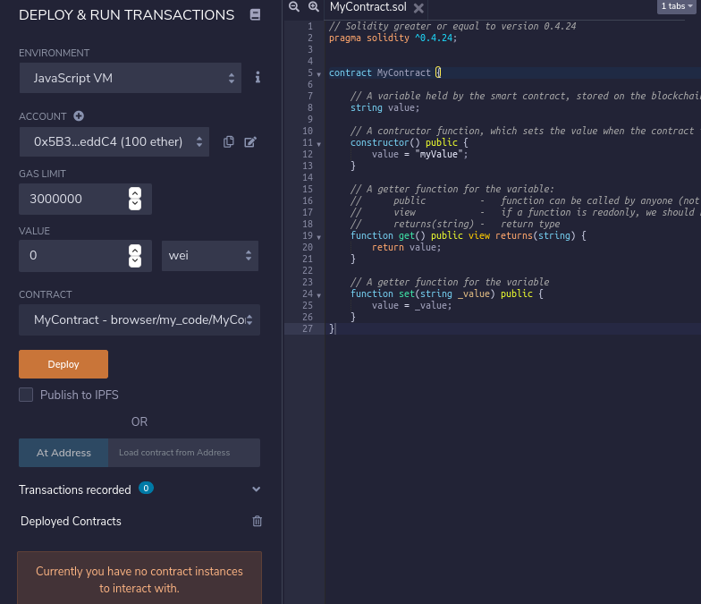
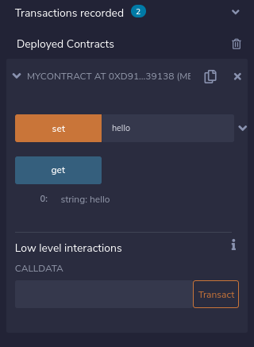
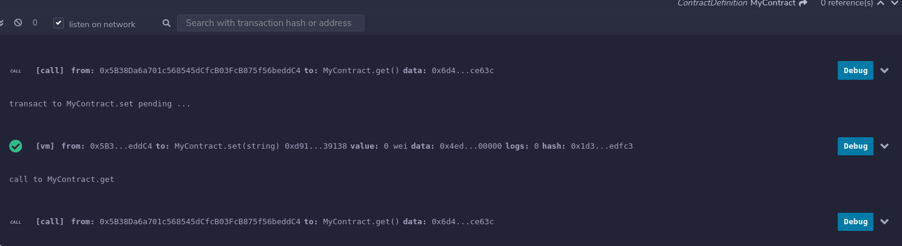
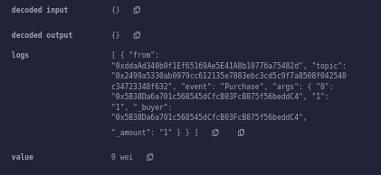
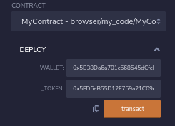
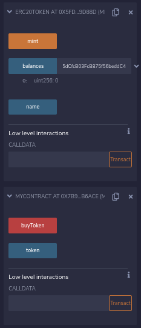

# Solidity Tutorial

By [Dapp University](https://www.youtube.com/dappuniversity) on YouTube

[Tutorial](https://www.youtube.com/watch?v=ipwxYa-F1uY&list=WL&index=6)

## Contents

- [Solidity Tutorial](#solidity-tutorial)
  - [Contents](#contents)
  - [01. Some info](#01-some-info)
  - [02. Basic Setter/Getter Contract (0.4.24)](#02-basic-settergetter-contract-0424)
  - [03. Shorthands, Primitive Types and Enums (0.5.10)](#03-shorthands-primitive-types-and-enums-0510)
  - [04. Structs & Arrays & Maps](#04-structs--arrays--maps)
  - [05. More about Modifiers](#05-more-about-modifiers)
    - [Auth-based permission modifier](#auth-based-permission-modifier)
    - [Time-based permission modifier](#time-based-permission-modifier)
  - [06. Payable Functions, Fallback Functions, Events](#06-payable-functions-fallback-functions-events)
    - [Simple ICO with payable address with fallback function and subscribable event](#simple-ico-with-payable-address-with-fallback-function-and-subscribable-event)
  - [07. Multiple Smart Contracts](#07-multiple-smart-contracts)
    - [Contract calls another contract](#contract-calls-another-contract)
    - [Contract inheritance](#contract-inheritance)
  - [08. Libraries And Math](#08-libraries-and-math)
    - [Custom math library](#custom-math-library)
    - [Importing library from separate file](#importing-library-from-separate-file)
    - [The SafeMath library](#the-safemath-library)
  - [End](#end)

## 01. Some info

* A smart contract is code that runs like a microservice.
* People can view it publicly, execute it, etc.
* Solidity is statically typed

We can try out Solidity easily in the browwser at https://remix.ethereum.org/, without needing any
configuration.

## 02. Basic Setter/Getter Contract (0.4.24)

We will create a smart contract which sets/gets a value stored on the blockchain.

```solidity
// Solidity greater or equal to version 0.4.24
pragma solidity ^0.4.24;


contract MyContract {

    // A variable held by the smart contract, stored on the blockchain
    string value;

    // A contructor function, which sets the value when the contract is first deployed
    constructor() public {
        value = "myValue";
    }

    // A getter function for the variable:
    //      public          -   function can be called by anyone (not just from within the contract)
    //      view            -   if a function is readonly, we should restrict or else we get a warning
    //      returns(string) -   return type
    function get() public view returns(string) {
        return value;
    }

    // A getter function for the variable
    function set(string _value) public {
        value = _value;
    }
}
```

Then we can go to the the Solidity Compiler tab and click compile.



Then we can go to the Deploy and Run section and deploy it to a local browser VM/simulator.



Then we can see that our smart contract has been deployed and can be interacted with.



We can see the transactions which have been enacted in the console.



## 03. Shorthands, Primitive Types and Enums (0.5.10)

We will upgrade to 0.5.10.

You will get an type error saying that the type of function parameters must be 'string memory'
instead of just 'string'.

(We can use default values and public variables to avoid constructors and get functions)

```solidity
pragma solidity ^0.5.1;

contract MyContract {

    // Define contract variables
    //      "public" visibility (instead of using a getter function)
    //      "constant" (to make it fixed value)
    //      default value (instead of using constructor)

    string public constant myString = "myValue";
    bool public myBool = true;
    int public myInt = -1;
    uint public myUint = 1; // unsigned
    uint8 public myUint8 = 255;
    uint256 public myUint256 = 42; // (default bits is 256)

    // Define an enum type for the application state

    enum State { Waiting, Ready, Active }
    State public myState = State.Waiting;

    // Define functions to set the state and check if the state is active

    function activate() public {
        myState = State.Active;
    }

    function isActive() public view returns(bool) {
        return myState == State.Active;
    }

}
```

## 04. Structs & Arrays & Maps

Structs and structs can be used.

We can set an array to public, however, it will only allow us to access a single element based on
the index.

Solidity does not know what the size of the array is.

We need to add a counter to count the number of people in the array (same with a mapping).

```solidity
pragma solidity ^0.5.1;

contract MyContract {
    Person[] public people;
    uint256 public peopleCount;

    struct Person {
        string _firstName;
        string _lastName;
    }

    function addPerson(string memory _firstName, string memory _lastName) public {
        people.push(Person(_firstName, _lastName));
        peopleCount += 1;
    }
}
```

We can also use hashmaps using the `mapping(X => Y)` type. Note that each key returns an empty
struct/type by default.

```solidity
pragma solidity ^0.5.1;

contract MyContract {
    mapping(uint => Person) public people;
    uint256 public peopleCount;

    struct Person {
        uint _id;
        string _firstName;
        string _lastName;
    }

    function addPerson(string memory _firstName, string memory _lastName) public {
        people[peopleCount] = Person(peopleCount, _firstName, _lastName);
        peopleCount += 1;
    }
}
```

## 05. More about Modifiers

Visibility
* public - all can access
* external - Cannot be accessed internally, only externally
* internal - only this contract and contracts deriving from it can access
* private - can be accessed only from this contract (subset of internal)

Custom modifiers
1. We can also add custom modifiers (i.e. can be used to only allow admin access)
1. We will make it so that only admins can call `addPerson()`.
2. Solidity has a global keyword `msg` which is the function call metadata (e.g. `msg.sender`).
3. The `_` underscore denotes where the rest of the function code is located.
4. We can get the current timestamp by accessing the current block (e.g. `block.timestamp`)

### Auth-based permission modifier

```solidity
pragma solidity ^0.5.1;

contract MyContract {

    mapping(uint => Person) public people;
    uint256 public peopleCount;
    address public owner;

    struct Person {
        uint _id;
        string _firstName;
        string _lastName;
    }

    modifier onlyOwner() {
        require(msg.sender == owner); // Raises an error if false
        _;
    }

    constructor() public {
        owner = msg.sender;
    }

    // onlyOwner = custom modifier
    function addPerson(string memory _firstName, string memory _lastName) public onlyOwner {
        incrementCount();
        people[peopleCount] = Person(peopleCount, _firstName, _lastName);
    }

    // internal = only accessible from within contract
    function incrementCount() internal {
        peopleCount += 1;
    }
}
```

### Time-based permission modifier

```solidity
pragma solidity ^0.5.1;

contract MyContract {

    mapping(uint => Person) public people;
    uint256 public peopleCount;
    uint256 public openingTime = 1613306320; // Some second timestamp

    struct Person {
        uint _id;
        string _firstName;
        string _lastName;
    }

    modifier onlyAfterOpeningTime() {
        require(block.timestamp >= openingTime); // Raises an error if false
        _;
    }

    // onlyOwner = custom modifier
    function addPerson(string memory _firstName, string memory _lastName) public onlyAfterOpeningTime {
        incrementCount();
        people[peopleCount] = Person(peopleCount, _firstName, _lastName);
    }

    // internal = only accessible from within contract
    function incrementCount() internal {
        peopleCount += 1;
    }
}
```

## 06. Payable Functions, Fallback Functions, Events

If we want to buy a token (for example in an ICO), we will want to accept ether.

### Simple ICO with payable address with fallback function and subscribable event

You can transfer funds using `wallet.transfer(msg.value)`.

```solidity
pragma solidity ^0.5.1;

contract MyContract {

    // 1) Functionality for an ICO.
    // Must explicitly state when things are payable

    mapping(address => uint256) public balances;
    address payable wallet;

    constructor(address payable _wallet) public {
        wallet = _wallet;
    }

    function buyToken() public payable {
        // Give token to sender
        balances[msg.sender] += 1; // Address of the sender

        // Transfer ether from sender to wallet
        wallet.transfer(msg.value); // The value - how much ether is sent in the call

        // Trigger an event
        emit Purchase(msg.sender, 1);
    }

    // 2) Fallback function: called when an non-defined function is called.
    // Has no name or arguments or return value.

    function() external payable {
        buyToken();
    }

    // 3) Events: used to allow external consumers to listen/subscribe to things.
    // We can also set a parameter to 'indexed' to allow us to filter events so
    // we only listen to certain buyers/things.

    event Purchase(address indexed _buyer, uint256 _amount);

}
```

When we trigger an event, the event will show up in the log.



## 07. Multiple Smart Contracts

Have a contract call another contract, and parent-child relationships.

### Contract calls another contract

We will have two contracts:
* ERC20Token - stores and mints the tokens.
* MyContract - an ICO contract

`msg.sender` will be the address of the contract, not the users. To get the user who initiated
the call, you need to use `tx.origin`.

```solidity
pragma solidity ^0.5.1;


contract ERC20Token {
    string public name;
    mapping(address => uint256) public balances;

    function mint() public {

        // !!! GOTCHYA
        // Cannot use 'msg.sender' because it is the address of the contract.
        // Use tx.origin - the address who initiated this transaction.

        balances[tx.origin]++;
    }
}

contract MyContract {

    address payable wallet;
    address public token;    // The address of our ERC20 token contract

    constructor(address payable _wallet, address _token) public {
        wallet = _wallet;
        token = _token;
    }

    function buyToken() public payable {
        // Call a function on another smart contract at an address
        ERC20Token _token = ERC20Token(address(token));
        _token.mint();

        wallet.transfer(msg.value);
    }

    function() external payable {
        buyToken();
    }
}
```

We can deploy both contracts, inserting the address of ERC20Token into MyContract.






### Contract inheritance

We can do inheritance via keyword `MyToken is ERC20Token`.

The superclass contructor needs to be included with the contructor.

Superclass methods can be called using `super.function()`.

```solidity
pragma solidity ^0.5.1;


contract ERC20Token {
    string public name;
    mapping(address => uint256) public balances;

    constructor(string memory _name) public {
        name = _name;
    }

    function mint() public {
        balances[tx.origin]++;
    }
}


contract MyToken is ERC20Token {
    string public symbol;
    address[] public owners;
    uint256 public ownerCount;

    constructor(string memory _name, string memory _symbol) ERC20Token(_name) public {
        symbol = _symbol;
    }

    function mint() public {
        super.mint();               // Call method in superclass
        owners.push(msg.sender);
        ownerCount++;
    }
}
```

## 08. Libraries And Math

`pure` function - does not modify state.

Import using `import "./Math.sol";`.

### Custom math library

```solidity
pragma solidity ^0.5.1;


library Math {
    function divide(uint256 a, uint256 b) internal pure returns (uint256) {
        require(b > 0);
        uint256 c = a / b;
        return c;
    }
}


contract MyToken {
    uint256 public value;

    function calculate(uint _value1, uint _value2) public {
        value = Math.divide(_value1, _value2);
    }
}
```

### Importing library from separate file

```solidity
pragma solidity ^0.5.1;

import "./Math.sol";

contract MyToken {
    uint256 public value;

    function calculate(uint _value1, uint _value2) public {
        value = Math.divide(_value1, _value2);
    }
}
```

### The SafeMath library

To solve our problems such as overflow, 0 division, etc, a library exists.

SafeMath: https://github.com/OpenZeppelin/openzeppelin-contracts/blob/master/contracts/math/SafeMath.sol

We can download the file and import the library `import "./SafeMath.sol";`.

For shorthand, we can also attach the library functions to the type using `using SafeMath for uint256;`.

```solidity
pragma solidity ^0.8.0;

import "./SafeMath.sol";

contract MyToken {
    using SafeMath for uint256;   // Attach library to type for shorthand
    uint256 public value;

    function calculate(uint _value1, uint _value2) public {
        //value = SafeMath.div(_value1, _value2);
        value = _value1.div(_value2);
    }
}
```

## End