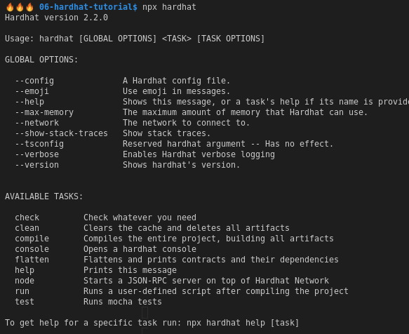

# Hardhat Tutorial

- [Hardhat Tutorial](#hardhat-tutorial)
  - [01. Initialisation](#01-initialisation)
    - [Initialise a project](#initialise-a-project)
    - [Install plugins](#install-plugins)
  - [02. Creating Contracts](#02-creating-contracts)
  - [03. Testing Contracts](#03-testing-contracts)

## 01. Initialisation

### Initialise a project
```
npm init -y
npm install -D hardhat
npx hardhat
> Create an empty hardhat.config.js
```

After we initialised a hardhat project, we can use the `npx hardhat` command to view options.



### Install plugins

```
npm install -D @nomiclabs/hardhat-ethers ethers @nomiclabs/hardhat-waffle chai ethereum-waffle
```
* `hardhat-ethers` allows us to use ethers library within hardhat
* `hardhat-waffle` for smart contract testing

We will add `require` to our `hardhat.config.js` for ethers and  waffle.

## 02. Creating Contracts

Create a contract:
```solidity
// "SPDX-License-Identifier: UNLICENSED"
pragma solidity ^0.7.0;

contract Token {
    string public name = 'My Hardhat Token';
    string public symbol = 'MHT';
    uint public totalSupply = 1000000;
    address public owner;
    mapping(address => uint) public balanceOf;

    constructor(){
        balanceOf[msg.sender] = totalSupply;
        owner = msg.sender;
    }

    function transfer(address to, uint amount) external {
        require(balanceOf[msg.sender] >= amount, 'Not enough tokens');
        balanceOf[msg.sender] -= amount;
        balanceOf[to] += amount;
    }
}
```

We can then build using `npx hardhat compile`.

This will create an `artifacts` and `cache` directory.

## 03. Testing Contracts

We will create tests.

Make sure that `ethereum-waffle` is installed.

We will be using ethers.