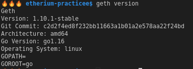
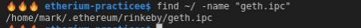

# (14) Deploying to the Rinkeby Test Network

## 01. Setup Rinkeby node

* We will install [geth](https://geth.ethereum.org/) on our local machines.
  * Geth is a full Ethereum node which we can use to connect to the Rinkerby network.
  * See [these instructions](https://gist.github.com/cryptogoth/10a98e8078cfd69f7ca892ddbdcf26bc) for more details.



* Use command `geth --rinkeby` to create a node on Rinkerby network. Wait for it to finish downloading.
  * You might want to specify the `--ipcpath "~/something/geth.ipc"`. Otherwise you can just search for the default one.
* Use command `geth attach` to see the JavaScript console.
  * Use `eth.syncing` to get information about the progress of syncronisation / download. (it will return false when the download is complete)
  * If you cannot attach, you need to either specify the ipc and/or find the `geth.ipc` file. And do: `geth attach ipc:/home/mark/.ethereum/rinkeby/geth.ipc`



* We can go to [rinkeby.etherscan.io](rinkeby.etherscan.io) to see block data.

## 02. Setup new Ethereum account on Rinkeby

* Create an account using the command `geth --rinkeby account new`
  * Enter a password/passphrase.

* To request for funds, go to https://faucet.rinkeby.io/.
  * We can click on the link to get directed to Twitter and post a tweet.
  * Then set the amount of Ether to get + how long to wait before you can make another request.

* When you do `geth attach`, you can see your account with funds.
  * `eth.accounts` to see the account you just created (or `eth.coinbase`)
  * `eth.getBalance(eth.coinbase)` to see the funds in the account you created.
  * Will not appear immediately if network is not downloaded yet. You should be able to see it on Etherscan.

## 03. Pre-Deployment Configuration

Now we have an account which owns ETH that can be used to deploy our smart contracts.

We can now add configuration to our project before we deploy.

* `truffle-config.js`
  * Add a second network to the `networks` object.
```
rinkeby: {
    host: "localhost",
    port: 8545,
    network_id: "4", // 4 = rinkeby
    gas: 4700000
},
```
* Unlock our account so we can use the account for deployment.
  * Go into the console. `geth attach`
  * Do `personal.unlockAccount(eth.accounts[0], null, 1200)` (null for password, 1200 for seconds unlocked)
  * Use `personal.listWallets` in the geth console to check the status of the account.

## 04. Smart Contract Deployment

Run the node via rpc (you will also need to allow insecure unlock)
```bash
geth --rinkeby --rpc --allow-insecure-unlock
```

Run command to push the code to our Rinkeby node. Make sure the account is unlocked.
```bash
cd token_sale
truffle migrate --reset --compile-all --network rinkeby
```

If the contracts were deployed successfully, we should be able to go to
`token_sale/build/contracts/DappToken.json` and see the contract address under
`networks: { 4: { ... } }`.

We can also check the status of the smart contract by search on Etherscan (rinkeby).

Do not use insecure-unlock on production nodes.

## 05. Trying the contract in geth console (initialising the contract with plain Web3)

ABI and Address is copied from `token_sale/build/contracts/*.json`:
* ABI array: `.abi`
* Contract Address: `.networks.4.address`

(API = abstract binary interface = contract interface)

```js
// Token Sale Instance
var tokenSaleAddress = '0xcA4ACb37786A79a5DDEc3de2ff49436083b59b52';
var tokenSaleAbi = [{"inputs": [{"internalType": "contract DappToken","name": "_tokenContract","type": "address"},{"internalType": "uint256","name": "_tokenPrice","type": "uint256"}],"stateMutability": "nonpayable","type": "constructor"},{"anonymous": false,"inputs": [{"indexed": false,"internalType": "address","name": "_buyer","type": "address"},{"indexed": false,"internalType": "uint256","name": "_amount","type": "uint256"}],"name": "Sell","type": "event"},{"inputs": [],"name": "tokenContract","outputs": [{"internalType": "contract DappToken","name": "","type": "address"}],"stateMutability": "view","type": "function","constant": true},{"inputs": [],"name": "tokenPrice","outputs": [{"internalType": "uint256","name": "","type": "uint256"}],"stateMutability": "view","type": "function","constant": true},{"inputs": [],"name": "tokensSold","outputs": [{"internalType": "uint256","name": "","type": "uint256"}],"stateMutability": "view","type": "function","constant": true},{"inputs": [],"name": "buyTokens","outputs": [{"internalType": "bool","name": "","type": "bool"}],"stateMutability": "payable","type": "function","payable": true},{"inputs": [],"name": "endSale","outputs": [],"stateMutability": "nonpayable","type": "function"}];
var TokenSaleContract = web3.eth.contract(tokenSaleAbi);
var tokenSale = TokenSaleContract.at(tokenSaleAddress);

// Token Instance
var tokenAddress = '0x04c931cF56D1994a7863FF4d6D141f8F0Ef0561a';
var tokenAbi = [{"inputs": [],"stateMutability": "nonpayable","type": "constructor"},{"anonymous": false,"inputs": [{"indexed": true,"internalType": "address","name": "_owner","type": "address"},{"indexed": true,"internalType": "address","name": "_spender","type": "address"},{"indexed": false,"internalType": "uint256","name": "_value","type": "uint256"}],"name": "Approval","type": "event"},{"anonymous": false,"inputs": [{"indexed": true,"internalType": "address","name": "_from","type": "address"},{"indexed": true,"internalType": "address","name": "_to","type": "address"},{"indexed": false,"internalType": "uint256","name": "_value","type": "uint256"}],"name": "Transfer","type": "event"},{"inputs": [{"internalType": "address","name": "","type": "address"},{"internalType": "address","name": "","type": "address"}],"name": "allowance","outputs": [{"internalType": "uint256","name": "","type": "uint256"}],"stateMutability": "view","type": "function","constant": true},{"inputs": [{"internalType": "address","name": "","type": "address"}],"name": "balanceOf","outputs": [{"internalType": "uint256","name": "","type": "uint256"}],"stateMutability": "view","type": "function","constant": true},{"inputs": [],"name": "decimals","outputs": [{"internalType": "uint8","name": "","type": "uint8"}],"stateMutability": "view","type": "function","constant": true},{"inputs": [],"name": "name","outputs": [{"internalType": "string","name": "","type": "string"}],"stateMutability": "view","type": "function","constant": true},{"inputs": [],"name": "symbol","outputs": [{"internalType": "string","name": "","type": "string"}],"stateMutability": "view","type": "function","constant": true},{"inputs": [],"name": "totalSupply","outputs": [{"internalType": "uint256","name": "","type": "uint256"}],"stateMutability": "view","type": "function","constant": true},{"inputs": [{"internalType": "address","name": "_to","type": "address"},{"internalType": "uint256","name": "_value","type": "uint256"}],"name": "transfer","outputs": [{"internalType": "bool","name": "","type": "bool"}],"stateMutability": "nonpayable","type": "function"},{"inputs": [{"internalType": "address","name": "_spender","type": "address"},{"internalType": "uint256","name": "_value","type": "uint256"}],"name": "approve","outputs": [{"internalType": "bool","name": "","type": "bool"}],"stateMutability": "nonpayable","type": "function"},{"inputs": [{"internalType": "address","name": "_from","type": "address"},{"internalType": "address","name": "_to","type": "address"},{"internalType": "uint256","name": "_value","type": "uint256"}],"name": "transferFrom","outputs": [{"internalType": "bool","name": "","type": "bool"}],"stateMutability": "nonpayable","type": "function"}];
var TokenContract = web3.eth.contract(tokenAbi);
var token = TokenContract.at(tokenAddress);
```
We should be able to interact with the contract in our geth JS console now.

```js
eth.getBalance(eth.coinbase)
token.balanceOf(eth.coinbase)
tokenSale.tokensSold()

// Buy 10 DAPP with 1 ETH
tokenSale.buyTokens({ from: eth.coinbase,  value: 1 * 1e18 })

eth.getBalance(eth.coinbase)
token.balanceOf(eth.coinbase)
tokenSale.tokensSold()

// eth.accounts[0] == eth.coinbase
```

## 05. Website Deployment

IMPORT THE RINKEBY ACCOUNT INTO METAMASK
* Using the keystore file (under `~/.ethereum/rinkeby/keystore`) and passphrase for the account.
* Then add the DAPP token with appropriate contract address.

Then run the website `npm run dev` and connect the wallet to the website under the Rinkeby network.

The website will connect to whatever network you have open in your MetaMask (either Genache or
Rinkeby). You can buy tokens from either network, but they will be different tokens in MetaMask
(different address on each network).

# (15) Website Deployment on GitHub pages

* We can deploy our website to a range of places.
* We will create a build for our website, and deploy to `gh-pages`.

