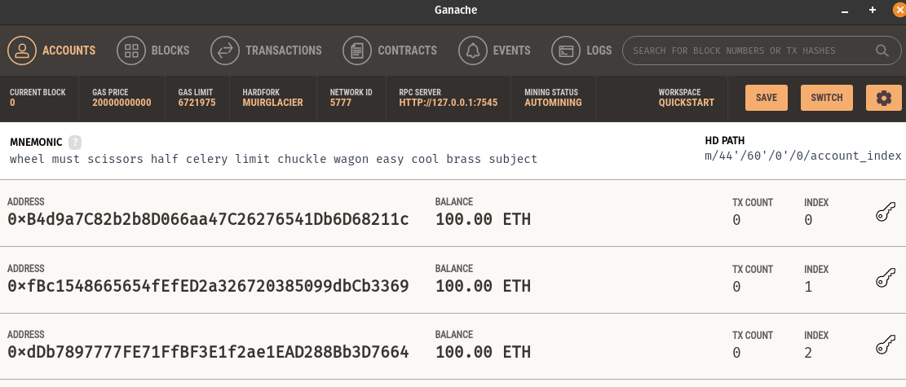

# Code Your Own Cryptocurrency on Ethereum

Playlist: https://www.youtube.com/watch?v=XdKv5uwEk5A&list=PLS5SEs8ZftgWFuKg2wbm_0GLV0Tiy1R-n

1. We are going to create a currency called 'DAPP Token'.
1. We will create a website where we can purchase the tokens.
1. We will create a token sale smart contract (ICO).

We will be using the Rinkeby Test Network to create the token
in a test environment with fake Ether.


## Contents

- [Code Your Own Cryptocurrency on Ethereum](#code-your-own-cryptocurrency-on-ethereum)
  - [Contents](#contents)
  - [01. Intro to ERC-20 & Setup](#01-intro-to-erc-20--setup)
    - [Truffle](#truffle)
    - [Genache](#genache)
    - [Metamask](#metamask)
  - [02. First Smart Contract with Truffle](#02-first-smart-contract-with-truffle)
    - [Setup](#setup)
    - [Create Token Contract + interaction](#create-token-contract--interaction)
    - [Testing](#testing)
    - [Connect to Metamask](#connect-to-metamask)


## 01. Intro to ERC-20 & Setup

ERC - Etherium Request for Comments

EIP - Etherium Improvement Proposal

ERC-20 defines the interface and functionality standards requied for a token.

We will install developer tools, which are part of the Truffle Suite.

### Truffle

The Truffle framework is a tool used for Ethereum development.

It gives us tools to write, test, and deploy our smart contracts using Solidity.

We can also develop client-side applications using Truffle.

Install: `npm install -g truffle`

> Truffle is a developer environment, testing framework and asset pipeline for blockchains. **It allows developers to spin up a smart contract project at the click of a button and provides you with a project structure, files, and directories that make deployment and testing much easier** (or else you would have to configure these yourself).

### Genache

Allows you to create a private blockchain with a local block explorer.

> Ganache allows you to create a private Ethereum blockchain for you to run tests, execute commands, and inspect state while controlling how the chain operates. **It gives you the ability to perform all actions you would on the main chain without the cost**. Many developers use this to test their smart contracts during development. It provides convenient tools such as advanced mining controls and a built-in block explorer.

Install: https://www.trufflesuite.com/ganache

### Metamask

We will use the MetaMask extension for the wallet.


## 02. First Smart Contract with Truffle

### Setup

1. Open Genache.



2. Navigate in terminal: `cd token_sale/`
3. Initialise a new Ethereum project using Truffle: `truffle init`


4. Go into `truffe-config.js` and add `network.development` information (localhost, with port
provided by the running Genashe instance).

### Create Token Contract + interaction

1. Create file `contracts/DappToken.sol`. It will be our ERC20 token.
2. After creating our basic token, we want to create a new migration file: `2_deploy_contracts.js`
3. Then we can run migrations using: `truffle migrate` (use --reset flag if needed) (set the `compilers.solc` option for your version of Solidity if needed)
4. Open the truffle console: `truffle console`. The Truffle console is a JS runtime environment.
5. We will see the `DappToken` object exists as a JavaScript object.
6. Get JS token object for the API using:

```js
let token;
DappToken.deployed().then(obj => token = obj);
```

7. We can now call functions.

```js
let totalSupply;
token.totalSupply().then(e => totalSupply = e);
totalSupply.toNumber() // 1,000,000

token.balanceOf("0xB4d9a7C82b2b8D066aa47C26276541Db6D68211c").then(e => e.toNumber()); // User owns 1,000,000 DappToken
```

8. We can see that the first address in Ganache has lost some Ethereum when we deployed our contract - and we can see that it has gained DappTokens.


### Testing

1. Truffle comes with the Mocha testing framework and Chai assertion library.

2. Create `test/DappToken.js`. e.g.

```js
const DappToken = artifacts.require("./DappToken.sol");

contract('DappToken', function(accounts) {

  it('sets the total supply upon deployment', function(){
    return DappToken.deployed().then(function(instance) {
      tokenInstance = instance;
      return tokenInstance.totalSupply();
    }).then(function(totalSupply){
      assert.equal(totalSupply.toNumber(), 1000000, 'sets the total supply to 1,000,000');
    });
  });

});
```

3. Run the tests using: `truffle test`

### Connect to Metamask

1. Add custom RPC
   1. RPC url: `http://127.0.0.1:7545`
   2. Chain ID: `1337`
2. Add new token
   1. Custom token
   2. Get address from Genache deployed contracts
3. Send tokens to your metamask

```js
let token;
DappToken.deployed().then(obj => token = obj);
token.transfer("0xF2A3cE8ba43A4224d480Be519E700D25a047f0C6", 5000); // Send 5 DAPP tokens
token.balanceOf("0xF2A3cE8ba43A4224d480Be519E700D25a047f0C6").then(e => e.toNumber());
```