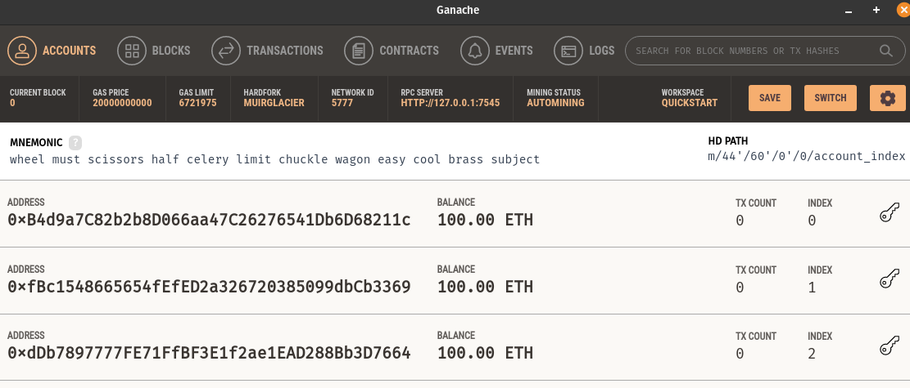
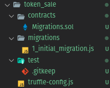

# Building the Crypto Smart Contracts

An ERC20 Token + Token Sale Contract.

Using the Truffle Suite:
* Genash development server
* JS, Mocha, Chai for unit testing.

## Contents

- [Building the Crypto Smart Contracts](#building-the-crypto-smart-contracts)
  - [Contents](#contents)
  - [01. Intro to ERC-20 & Setup](#01-intro-to-erc-20--setup)
    - [Truffle](#truffle)
    - [Genache](#genache)
    - [Metamask](#metamask)
  - [02. First Smart Contract with Truffle](#02-first-smart-contract-with-truffle)
    - [Setup](#setup)
    - [Create Token Contract + interaction](#create-token-contract--interaction)
    - [Testing](#testing)
    - [Connect to Metamask](#connect-to-metamask)
  - [03. Creating an ERC-20 Token Smart Contract](#03-creating-an-erc-20-token-smart-contract)
    - [Constructor arguments deployment](#constructor-arguments-deployment)
    - [Using metamask to transfer + view token funds](#using-metamask-to-transfer--view-token-funds)
  - [04. Sending ERC20 Tokens (transfer)](#04-sending-erc20-tokens-transfer)
  - [05. and 06. An Exchange-Ready ERC20 Token (approve/allowance delegation)](#05-and-06-an-exchange-ready-erc20-token-approveallowance-delegation)
  - [07. Smart Contracts in the Console](#07-smart-contracts-in-the-console)
  - [08. Crowd Sale Smart Contract (ICO)](#08-crowd-sale-smart-contract-ico)
  - [09. Token Purchase BUY function](#09-token-purchase-buy-function)
  - [10. Ending a Token Sale](#10-ending-a-token-sale)

## 01. Intro to ERC-20 & Setup

ERC - Etherium Request for Comments

EIP - Etherium Improvement Proposal

ERC-20 defines the interface and functionality standards requied for a token.

We will install developer tools, which are part of the Truffle Suite.

### Truffle

The Truffle framework is a tool used for Ethereum development.

It gives us tools to write, test, and deploy our smart contracts using Solidity.

We can also develop client-side applications using Truffle.

Install: `npm install -g truffle`

> Truffle is a developer environment, testing framework and asset pipeline for blockchains. **It allows developers to spin up a smart contract project at the click of a button and provides you with a project structure, files, and directories that make deployment and testing much easier** (or else you would have to configure these yourself).

### Genache

Allows you to create a private blockchain with a local block explorer.

> Ganache allows you to create a private Ethereum blockchain for you to run tests, execute commands, and inspect state while controlling how the chain operates. **It gives you the ability to perform all actions you would on the main chain without the cost**. Many developers use this to test their smart contracts during development. It provides convenient tools such as advanced mining controls and a built-in block explorer.

Install: https://www.trufflesuite.com/ganache

### Metamask

We will use the MetaMask extension for the wallet.


## 02. First Smart Contract with Truffle

### Setup

1. Open Genache.



2. Navigate in terminal: `cd token_sale/`
3. Initialise a new Ethereum project using Truffle: `truffle init`



4. Go into `truffe-config.js` and add `network.development` information (localhost, with port
provided by the running Genashe instance).

### Create Token Contract + interaction

* `truffle migrate`
* `trufle console`

1. Create file `contracts/DappToken.sol`. It will be our ERC20 token.
2. After creating our basic token, we want to create a new migration file: `2_deploy_contracts.js`
3. Then we can run migrations using: `truffle migrate` (use --reset flag if needed) (set the `compilers.solc` option for your version of Solidity if needed)
4. Open the truffle console: `truffle console` (the Truffle console is a JS runtime environment)
5. We will see the `DappToken` object exists as a JavaScript object.
6. Get JS token object for the API using:

```js
let token;
DappToken.deployed().then(obj => token = obj);
```

7. We can now call functions.

```js
let totalSupply;
token.totalSupply().then(e => totalSupply = e);
totalSupply.toNumber() // 1,000,000

token.balanceOf("0xB4d9a7C82b2b8D066aa47C26276541Db6D68211c").then(e => e.toNumber()); // User owns 1,000,000 DappToken
```

8. We can see that the first address in Ganache has lost some Ethereum when we deployed our contract - and we can see that it has gained DappTokens.


### Testing

1. Truffle comes with the Mocha testing framework and Chai assertion library.

2. Create `test/DappToken.js`. e.g.

```js
const DappToken = artifacts.require("./DappToken.sol");

contract('DappToken', function(accounts) {

  it('sets the total supply upon deployment', function(){
    return DappToken.deployed().then(function(instance) {
      tokenInstance = instance;
      return tokenInstance.totalSupply();
    }).then(function(totalSupply){
      assert.equal(totalSupply.toNumber(), 1000000, 'sets the total supply to 1,000,000');
    });
  });

});
```

3. Run the tests using: `truffle test`

### Connect to Metamask

1. Add custom RPC
   1. RPC url: `http://127.0.0.1:7545`
   2. Chain ID: `1337`
2. Add new token
   1. Custom token
   2. Get address from Genache deployed contracts
3. Send tokens to your metamask

```js
let token;
DappToken.deployed().then(obj => token = obj);
token.transfer("0xF2A3cE8ba43A4224d480Be519E700D25a047f0C6", 5000); // Send 5 DAPP tokens
token.balanceOf("0xF2A3cE8ba43A4224d480Be519E700D25a047f0C6").then(e => e.toNumber());
```

> Note: every time we run migrations with --reset, we fork our contract - so we need to put in a new token.

## 03. Creating an ERC-20 Token Smart Contract

Conventions:
* FileNames = Capwords = Same as the library/contract they represent
* Structs or Contracts or Events = CapWords
* functionNames = mixedCase/camelCase
* localVariables or stateVariables or modifiers = mixedCase/camelCase

*** functionParameters have _underscores in ERC20 examples and docs, even though the conventions show otherwise.

See ERC20 standards documentation.

### Constructor arguments deployment

In `migrations/2_deploy_contracts.js`, we can pass additional arguments to the deploy function
to add arguments to the contstructor of the contract

```js
const DappToken = artifacts.require("./DappToken.sol");

module.exports = function (deployer) {
  deployer.deploy(DappToken, 1, 2, 3, 'hello'); // <--- constructor arguments
};

```

### Using metamask to transfer + view token funds

You can import the Genash accounts via private keys into Metamask.

After adding the DAPP token, you can see the token balance of the account.

> If you use truffle migrate --reset, you must re-add the token to each account. The accounts
> addresses are not changed.

## 04. Sending ERC20 Tokens (transfer)

We need a `transfer` function.

If you use the JavaScript `token.transfer.call('0x123...', 5)` method, it
**returns the function value** without submitting the transaction. (like a data call, which can be
used for testing a transaction)

If you use `token.transfer('0x123...', 5)`, it will **submit the transaction** and return the
reciept.

## 05. and 06. An Exchange-Ready ERC20 Token (approve/allowance delegation)

We need a `approve`, and `transferFrom` function for delegated spending.

In unit tests, we can add an additional parameter `{from: delegate}` to specifier the sender of
a transaction.

We can also view and validate the event logs (`reciept.logs[0].args.*`) and validate them in our
tests.

## 07. Smart Contracts in the Console

In `truffle console`, we can test our allowance methods like this:

```js
DappToken.deployed().then(e => token = e);
let owner = accounts[1];
let spender = accounts[2];

token.allowance(owner, spender).then(e => e.toNumber()); // allowance of 0
token.approve(spender, 100, { from: owner });
token.allowance(owner, spender).then(e => e.toNumber()); // allowance of 100
```

## 08. Crowd Sale Smart Contract (ICO)

How it works:
1. Provision tokens to token sale contract
1. Set token price in WEI
1. Assign an admin
1. Buy tokens
1. End sale

We will create a new contract called `DappTokenSale.sol` and add the contract to
the `2_deploy_contracts.js` migration file.

## 09. Token Purchase BUY function

We need a `buyTokens` function so buyers can purchase tokens at the specified token price (wei).

This will also emit a `Sale` event.

The contract address can own and send ERC tokens. To supply fuel to the token sale contract,
we will send DAPP tokens from `accounts[0]` to `DappTokenSale.address`.

We can also add a check to ensure that the contract owns enough tokens for the buyer - (although
this is redundant):

```solidity
require(tokensBought <= tokenContract.balanceOf(address(this))); // Redundant
```

> Note: I kinda want to add a 'tokensAvailable' method to the token sale contract..

## 10. Ending a Token Sale

We will create an `endSale` function which will:
1. Return unsold DAPP tokens to admin
2. Destroy this contract and give ETH to the admin

The `selfdestruct(address)` function can be used to destroy a contract and transfer the ETH
balance to a user.
